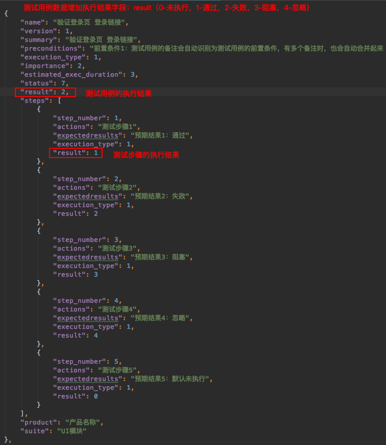
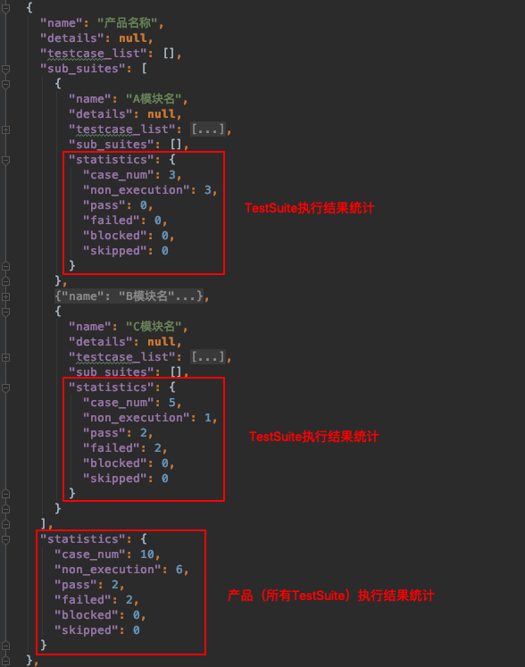

# XMind2TestCasePro
:::success
- 标题：文章模板
- 分类：`模板`
- 标签：`test`、`autotest`
- 简介：这个是文章模板
:::

---


<a name="pTuQo"></a>
## 1. 区别
`[xmind2testcase](https://github.com/zhuifengshen/xmind2testcase/tree/master/xmind2testcase)`与`[xmind2testcasepro](https://github.com/goehls/xmind2testcasepro)`的区别：

- 支持新版本的xmind文件的解析，同时支持旧版本的xmind文件的解析
- 用例的展示更加丰富，更加精细。
   - 在保持testcase title的前提下，将非testcase节点的部分提取为Category
   - 不同节点的title链接的展示优化
- 测试模板支持一个测试步骤包含多个预期结果。


## 2. 测试用例模板

### 2.1 用例模板
[用例模板](docs/new/)
[[公众号：波小艺] 测试用例 模版.xmind](docs%2Fnew%2F%5B%E5%85%AC%E4%BC%97%E5%8F%B7%EF%BC%9A%E6%B3%A2%E5%B0%8F%E8%89%BA%5D%20%E6%B5%8B%E8%AF%95%E7%94%A8%E4%BE%8B%20%E6%A8%A1%E7%89%88.xmind)
<br />标签（label）：**测试用例**、**执行步骤、预期结果**、**前置条件**、**优先级**标签（如：P1）<br />标记（marker）：优先级标记，label优先级更高<br />备注：summary。测试用例节点才会被解析。


### 2.2 模板解析规则

- 中心主题默认为产品名称
- 中心主题的第一层会被识别为`testsuite`
- 包含`测试用例`标签的节点的会识别为`testcase`
- `testsuite`- `testcase`之间的节点title被识别为用例的分类（Category）
- `testcase`的子主题包含`前置条件`标签的为`PreConditions`、包含`执行步骤`标签的为`teststep`
- `teststep`的子主题包含`预期结果`标签的为`ExpectResults`，一个执行步骤可以包含多个预期结果。
- `testcase`的优先级可用marker进行标记。也可以通过label进行标记（如P0，priority 1），label的优先级更高
- `testcase`的执行类型通过label定义：`手动`、`自动`。默认为`手动`。
- `testcase`的摘要summary通过`testcase`节点的备注记录
- `testcase`节点包含`ignore`标签时，会被打上一个`ignore`的标记
- 自由主题不会被解析


<a name="yKo9C"></a>
## 3. 模板解析结果
`xmind2testcasepro`解析并渲染到前端的结果如下：


- Suite表示模块名称。
- Category表示**模块节点**到**测试用例节点**中间包含的这些节点的集合。
- Title表示测试用例名称。
- PreConditions表示前置条件，可以包含多个。
- Attributes包含用例的优先级priority，测试用例节点的备注summary。
- Steps表示执行步骤以及预期结果，一个执行步骤可对应多个预期结果。
- 对于无效的用例，忽略的用例，用户可以选择是否将其展示出来。


# XMind2TestCase

> **XMind2TestCase** 工具，提供了一个高效测试用例设计的解决方案！

fork 仓库：https://github.com/zhuifengshen/xmind2testcase
### 一、背景

软件测试过程中，最重要、最核心就是测试用例的设计，也是测试童鞋、测试团队日常投入最多时间的工作内容之一。

然而，传统的测试用例设计过程有很多痛点：
- 1、使用Excel表格进行测试用例设计，虽然成本低，但版本管理麻烦，维护更新耗时，用例评审繁琐，过程报表统计难...
- 2、使用TestLink、TestCenter、Redmine等传统测试管理工具，虽然测试用例的执行、管理、统计比较方便，但依然存在编写用例效率不高、思路不够发散、在产品快速迭代过程中比较耗时等问题...
- 3、公司自研测试管理工具，这是个不错的选择，但对于大部分小公司、小团队来说，一方面研发维护成本高，另一方面对技术要有一定要求...
- 4、...


基于这些情况，现在越来越多公司选择使用**思维导图**这种高效的生产力工具进行用例设计，特别是敏捷开发团队。

事实上也证明，思维导图其发散性思维、图形化思维的特点，跟测试用例设计时所需的思维非常吻合，所以在实际工作中极大提升了我们测试用例设计的效率，也非常方便测试用例评审。

但是与此同时，使用思维导图进行测试用例设计的过程中也带来不少问题：
- 1、测试用例难以量化管理、执行情况难以统计；
- 2、测试用例执行结果与BUG管理系统难以打通；
- 3、团队成员用思维导图设计用例的风格各异，沟通成本巨大；
- 4、...

综合以上情况，我们可以发现不同的测试用例设计方式，各有各个的优劣。

那么问题来了，我们能不能将它们各自优点合在一起呢？这样不就可以提升我们的效率了！

于是，这时候 **XMind2TestCase** 就应运而生了，该工具基于 Python 实现，通过制定**测试用例通用模板**，
然后使用 **[XMind](https://www.xmind.cn/)** 这款广为流传且开源的思维导图工具进行用例设计。
其中制定**测试用例通用模板**是一个非常核心的步骤（具体请看[使用指南](https://github.com/zhuifengshen/xmind2testcase/blob/master/webtool/static/guide/index.md)），有了通用的测试用例模板，我们就可以在 XMind 文件上解析并提取出测试用例所需的基本信息，
然后合成常见**测试用例管理系统**所需的**用例导入文件**。这样就将 **XMind 设计测试用例的便利**与**常见测试用例系统的高效管理**结合起来了！

当前 **XMind2TestCase** 已实现从 XMind 文件到 TestLink 和 Zentao(禅道) 两大常见用例管理系统的测试用例转换，同时也提供 XMind 文件解析后的两种数据接口
（TestSuites、TestCases两种级别的JSON数据），方便快速与其他测试用例管理系统打通。


### 二、使用示例

#### 1、Web工具示例


#### 2、转换后用例预览


#### 3、TestLink导入结果示例


#### 4、禅道（ZenTao）导入结果示例


### 三、安装方式
```
pip3 install xmind2testcase
```


### 四、版本升级
```
pip3 install -U xmind2testcase
```


### 五、使用方式

#### 1、命令行调用
```
Usage:
 xmind2testcase [path_to_xmind_file] [-csv] [-xml] [-json]

Example:
 xmind2testcase /path/to/testcase.xmind        => output testcase.csv、testcase.xml、testcase.json
 xmind2testcase /path/to/testcase.xmind -csv   => output testcase.csv
 xmind2testcase /path/to/testcase.xmind -xml   => output testcase.xml
 xmind2testcase /path/to/testcase.xmind -json  => output testcase.json
```

#### 2、使用Web界面


```
Usage:
 xmind2testcase [webtool] [port_num]

Example:
 xmind2testcase webtool        => launch the web testcase convertion tool locally -> 127.0.0.1:5001
 xmind2testcase webtool 8000   => launch the web testcase convertion tool locally -> 127.0.0.1:8000
```

#### 3、API调用
```
import json
import xmind
from xmind2testcase.zentao import xmind_to_zentao_csv_file
from xmind2testcase.testlink import xmind_to_testlink_xml_file
from xmind2testcase.utils import xmind_testcase_to_json_file
from xmind2testcase.utils import xmind_testsuite_to_json_file
from xmind2testcase.utils import get_xmind_testcase_list
from xmind2testcase.utils import get_xmind_testsuite_list


def main():
    xmind_file = 'docs/xmind_testcase_template.xmind'
    print('Start to convert XMind file: %s' % xmind_file)

    zentao_csv_file = xmind_to_zentao_csv_file(xmind_file)
    print('Convert XMind file to zentao csv file successfully: %s' % zentao_csv_file)

    testlink_xml_file = xmind_to_testlink_xml_file(xmind_file)
    print('Convert XMind file to testlink xml file successfully: %s' % testlink_xml_file)

    testsuite_json_file = xmind_testsuite_to_json_file(xmind_file)
    print('Convert XMind file to testsuite json file successfully: %s' % testsuite_json_file)

    testcase_json_file = xmind_testcase_to_json_file(xmind_file)
    print('Convert XMind file to testcase json file successfully: %s' % testcase_json_file)

    testsuites = get_xmind_testsuite_list(xmind_file)
    print('Convert XMind to testsuits dict data:\n%s' % json.dumps(testsuites, indent=2, separators=(',', ': '), ensure_ascii=False))

    testcases = get_xmind_testcase_list(xmind_file)
    print('Convert Xmind to testcases dict data:\n%s' % json.dumps(testcases, indent=4, separators=(',', ': ')))

    workbook = xmind.load(xmind_file)
    print('Convert XMind to Json data:\n%s' % json.dumps(workbook.getData(), indent=2, separators=(',', ': '), ensure_ascii=False))

    print('Finished conversion, Congratulations!')


if __name__ == '__main__':
    main()
```

#### 4、XMind用例文件转为JSON数据


##### （1）转为TestCase JSON数据

```
from xmind2testcase.utils import get_xmind_testcase_list
xmind_file = 'docs/xmind_testcase_demo.xmind'
testcases = get_xmind_testcase_list(xmind_file)
print(testcases)


Output:

[
    {                                                # 测试用例
        "name": "测试用例1",                           # 用例标题
        "version": 1,                                 # 用例版本
        "summary": "测试用例1",                        # 用例摘要
        "preconditions": "前置条件",                   # 前置条件
        "execution_type": 1,                          # 用例执行类型（1：手动、2：自动）
        "importance": 1,                              # 优先级（1：高、2：中、3：低）
        "estimated_exec_duration": 3,                 # 预计执行时间（分钟）
        "status": 7,                                  # 用例状态（1：草稿、2：待评审、3：评审中、4：重做、5、废弃、6：feature、7：终稿）
        "steps": [                                    # 测试步骤列表
            {
                "step_number": 1,                     # 编号
                "actions": "测试步骤1",                 # 步骤内容
                "expectedresults": "预期结果1",         # 预期结果
                "execution_type": 1                    # 执行类型（1：手动，2：自动）
            }, 
            {
                "step_number": 2, 
                "actions": "测试步骤2", 
                "expectedresults": "预期结果2", 
                "execution_type": 1
            }
        ], 
        "product": "我是产品名",                          # 产品名称
        "suite": "我是模块名(测试集1)"                     # 测试集（模块名）
    }, 
    {
        "name": "测试用例2", 
        "version": 1, 
        "summary": "测试用例2", 
        "preconditions": "前置条件", 
        "execution_type": 1, 
        "importance": 1, 
        "estimated_exec_duration": 3, 
        "status": 7, 
        "steps": [
            {
                "step_number": 1, 
                "actions": "测试步骤1", 
                "expectedresults": "预期结果1", 
                "execution_type": 1
            }, 
            {
                "step_number": 2, 
                "actions": "测试步骤2（预期结果2可以为空）", 
                "expectedresults": "", 
                "execution_type": 1
            }, 
            {
                "step_number": 3, 
                "actions": "测试步骤3", 
                "expectedresults": "预期结果3", 
                "execution_type": 1
            }, 
            {
                "step_number": 4, 
                "actions": "测试步骤4", 
                "expectedresults": "预期结果4", 
                "execution_type": 1
            }
        ], 
        "product": "我是产品名", 
        "suite": "我是模块名(测试集1)"
    }, 
    {
        "name": "测试用例3（测试步骤和预期结果可以都为空）", 
        "version": 1, 
        "summary": "测试用例3（测试步骤和预期结果可以都为空）", 
        "preconditions": "无", 
        "execution_type": 1, 
        "importance": 2, 
        "estimated_exec_duration": 3, 
        "status": 7, 
        "steps": [ ], 
        "product": "我是产品名", 
        "suite": "我是模块名(测试集1)"
    }, 
    {
        "name": "测试步骤2（优先级默认为中）", 
        "version": 1, 
        "summary": "测试步骤2（优先级默认为中）", 
        "preconditions": "无", 
        "execution_type": 1, 
        "importance": 3, 
        "estimated_exec_duration": 3, 
        "status": 7, 
        "steps": [
            {
                "step_number": 1, 
                "actions": "测试步骤1", 
                "expectedresults": "预期结果1", 
                "execution_type": 1
            }, 
            {
                "step_number": 2, 
                "actions": "测试步骤3", 
                "expectedresults": "", 
                "execution_type": 1
            }
        ], 
        "product": "我是产品名", 
        "suite": "我是模块名(测试集2)"
    }, 
    {
        "name": "测试用例3（前置条件默认为空） 无设置优先级，这里加入用例标题", 
        "version": 1, 
        "summary": "测试用例3（前置条件默认为空） 无设置优先级，这里加入用例标题", 
        "preconditions": "无", 
        "execution_type": 1, 
        "importance": 2, 
        "estimated_exec_duration": 3, 
        "status": 7, 
        "steps": [ ], 
        "product": "我是产品名", 
        "suite": "我是模块名(测试集2)"
    }
]
```

测试用例数据增加执行结果字段：result，示例如下：



详情查看[使用指南](webtool/static/guide/index.md)，参考示例：[testcase json](docs/xmind_to_testcase_json.json)


##### （2）转为TestSuite JSON数据

```
from xmind2testcase.utils import get_xmind_testsuite_list
xmind_file = 'docs/xmind_testcase_demo.xmind'
testsuites = get_xmind_testsuite_list(xmind_file)
print(testsuites)


Output:

[
  {                                                 # XMind画布（Sheet)列表
    "name": "我是产品名",                             # 产品名称
    "details": null,                                 # 产品摘要
    "testcase_list": [],                             # 用例列表
    "sub_suites": [                                  # 用例集列表
      {
        "name": "我是模块名(测试集1)",                  # 用例集1名称（模块名）
        "details": null,                             # 用例集摘要
        "testcase_list": [                           # 用例列表
          {                                          # 具体用例
            "name": "测试用例1",
            "version": 1,
            "summary": "测试用例1",
            "preconditions": "前置条件",
            "execution_type": 1,
            "importance": 1,
            "estimated_exec_duration": 3,
            "status": 7,
            "steps": [
              {
                "step_number": 1,
                "actions": "测试步骤1",
                "expectedresults": "预期结果1",
                "execution_type": 1
              },
              {
                "step_number": 2,
                "actions": "测试步骤2",
                "expectedresults": "预期结果2",
                "execution_type": 1
              }
            ]
          },
          {
            "name": "测试用例2",
            "version": 1,
            "summary": "测试用例2",
            "preconditions": "前置条件",
            "execution_type": 1,
            "importance": 1,
            "estimated_exec_duration": 3,
            "status": 7,
            "steps": [
              {
                "step_number": 1,
                "actions": "测试步骤1",
                "expectedresults": "预期结果1",
                "execution_type": 1
              },
              {
                "step_number": 2,
                "actions": "测试步骤2（预期结果2可以为空）",
                "expectedresults": "",
                "execution_type": 1
              },
              {
                "step_number": 3,
                "actions": "测试步骤3",
                "expectedresults": "预期结果3",
                "execution_type": 1
              },
              {
                "step_number": 4,
                "actions": "测试步骤4",
                "expectedresults": "预期结果4",
                "execution_type": 1
              }
            ]
          },
          {
            "name": "测试用例3（测试步骤和预期结果可以都为空）",
            "version": 1,
            "summary": "测试用例3（测试步骤和预期结果可以都为空）",
            "preconditions": "无",
            "execution_type": 1,
            "importance": 2,
            "estimated_exec_duration": 3,
            "status": 7,
            "steps": []
          }
        ],
        "sub_suites": []                            # 用例集中可以包含子用例集（目前只要产品类别下有用例集）
      },
      {
        "name": "我是模块名(测试集2)",                  # 用例集2名称（模块名）
        "details": "测试集摘要（详情）",
        "testcase_list": [
          {
            "name": "测试步骤2（优先级默认为中）",
            "version": 1,
            "summary": "测试步骤2（优先级默认为中）",
            "preconditions": "无",
            "execution_type": 1,
            "importance": 3,
            "estimated_exec_duration": 3,
            "status": 7,
            "steps": [
              {
                "step_number": 1,
                "actions": "测试步骤1",
                "expectedresults": "预期结果1",
                "execution_type": 1
              },
              {
                "step_number": 2,
                "actions": "测试步骤3",
                "expectedresults": "",
                "execution_type": 1
              }
            ]
          },
          {
            "name": "测试用例3（前置条件默认为空） 无设置优先级，这里加入用例标题",
            "version": 1,
            "summary": "测试用例3（前置条件默认为空） 无设置优先级，这里加入用例标题",
            "preconditions": "无",
            "execution_type": 1,
            "importance": 2,
            "estimated_exec_duration": 3,
            "status": 7,
            "steps": []
          }
        ],
        "sub_suites": []
      }
    ]
  }
]
```

TestSuite增加执行结果统计字段：statistics，示例如下：



参考示例：[testsuite json](docs/xmind_to_testsuite_json.json)


##### （3）XMind文件转换为JSON数据

以上（1）TestCase数据、（2）TestSuite数据的获取，其实是基于**[XMind](https://github.com/zhuifengshen/xmind)**这个工具，对XMind文件进行解析和数据提取，然后转换而来。
这个工具是在设计XMind2TestCase时，针对XMind单独抽取出来的库，提供了XMind思维导图创建、解析、更新的一系列方法。使用它可以直接将XMind文件转换为JSON数据：

```
import xmind
xmind_file = 'docs/xmind_testcase_demo.xmind'
workbook = xmind.load(xmind_file)
data = workbook.getData()
print(data)


Output:

[
  {                                                    # XMind画布(sheet)列表
    "id": "7hmnj6ahp0lonp4k2hodfok24f",                # 画布ID
    "title": "画布 1",                                  # 画布名称
    "topic": {                                         # 中心主题
      "id": "7c8av5gt8qfbac641lth4g1p67",              # 主题ID
      "link": null,                                    # 主题上的超链接信息
      "title": "我是产品名",                             # 主题名称
      "note": null,                                    # 主题上的备注信息
      "label": null,                                   # 主题上标签信息
      "comment": null,                                 # 主题上的批注（评论）信息
      "markers": [],                                   # 主题上的图标信息
      "topics": [                                      # 子主题列表
        {
          "id": "2rj4ek3nn4sk0lc4pje3gvgv9k",
          "link": null,
          "title": "我是模块名(测试集1)",                  # 子主题1
          "note": null,
          "label": null,
          "comment": null,
          "markers": [],
          "topics": [                                    # 子主题下的子主题列表
            {
              "id": "3hjj43s7rv66uncr1srl3qsboi",
              "link": null,
              "title": "测试用例1",
              "note": "前置条件\n",
              "label": "手动（执行方式默认为手动）",
              "comment": null,
              "markers": [
                "priority-1"
              ],
              "topics": [
                {
                  "id": "3djn37j1fdc6081de319slf035",
                  "link": null,
                  "title": "测试步骤1",
                  "note": null,
                  "label": null,
                  "comment": null,
                  "markers": [],
                  "topics": [
                    {
                      "id": "7v0f1152popou38ndaaamt49l5",
                      "link": null,
                      "title": "预期结果1",
                      "note": null,
                      "label": null,
                      "comment": null,
                      "markers": []
                    }
                  ]
                },
                {
                  "id": "2srtqqjp818clkk1drm233lank",
                  "link": null,
                  "title": "测试步骤2",
                  "note": null,
                  "label": null,
                  "comment": null,
                  "markers": [],
                  "topics": [
                    {
                      "id": "4jlbo280urmid3qkd01j7h8jnq",
                      "link": null,
                      "title": "预期结果2",
                      "note": null,
                      "label": null,
                      "comment": null,
                      "markers": []
                    }
                  ]
                }
              ]
            },
            ...
          ]
        },
        ...
      ]
    }
  }
]
```
具体参考：[xmind_testcase_demo.json](https://github.com/zhuifengshen/xmind2testcase/blob/master/docs/xmind_testcase_demo.json)


### 四、自动化发布：一键打 Tag 并上传至 PYPI 

每次在 __ about __.py 更新版本号后，运行以下命令，实现自动化更新打包上传至 [PYPI](https://pypi.org/) ，同时根据其版本号自动打 Tag 并推送到仓库：

```
python3 setup.py pypi
```


### 五、CHANGELOG

```
v1.0.0
1、XMind用例模板定义和解析；
2、XMind用例转换为TestLink用例文件；

v1.1.0
1、XMind用例文件转换为禅道用例文件；
2、添加一键上传PYPI功能；

v1.2.0
1、添加Web工具进行用例转换；
2、添加用户使用指南；

v1.3.0
1、XMind中支持标识测试用例执行结果；
2、TestCase、TestSuite中添加用例执行结果统计数据；
3、完善用户使用指南；

v1.5.0
1、支持通过标签设置用例类型（自动 or 手动）；
2、支持导出文件中文显示；
3、增加命令运行指引；
4、修复服务器远程部署无法访问问题；
5、取消测试用例关键字默认设置；

备注：XMind2Testcase针对XMind经典系列版本，暂不支持XMind Zen版本！
```


### 六、致谢
**XMind2TestCase** 工具的产生，受益于以下四个开源项目，并在此基础上扩展、优化，受益匪浅，感恩！

- 1、**[XMind](https://github.com/zhuifengshen/xmind)**：XMind思维导图创建、解析、更新的一站式解决方案(Python实现)！  
- 2、**[xmind2testlink](https://github.com/tobyqin/xmind2testlink)**：践行了XMind通用测试用例模板设计思路，同时提供了Web转换工具！
- 3、**[TestLink](http://www.testlink.org/)**：提供了完整的测试用例管理流程和文档；
- 4、**[禅道开源版(ZenTao)](https://www.zentao.net/)**：提供了完整的项目管理流程、文档和用户交流释疑群；

得益于开源，也将坚持开源，并为努力开源贡献自己的点滴之力。后续，将继续根据实际项目需要，定期进行更新维护，
欢迎大伙的[使用](https://github.com/zhuifengshen/xmind2testcase/blob/master/webtool/static/guide/index.md)和[意见反馈](https://github.com/zhuifengshen/xmind2testcase/issues/new)，谢谢！

（如果本项目对你有帮助的话，也欢迎 _**[star](https://github.com/zhuifengshen/xmind2testcase)**_ ）


### LICENSE
```
MIT License

Copyright (c) 2019 Devin https://zhangchuzhao.site
Copyright (c) 2017 Toby Qin

Permission is hereby granted, free of charge, to any person obtaining a copy
of this software and associated documentation files (the "Software"), to deal
in the Software without restriction, including without limitation the rights
to use, copy, modify, merge, publish, distribute, sublicense, and/or sell
copies of the Software, and to permit persons to whom the Software is
furnished to do so, subject to the following conditions:

The above copyright notice and this permission notice shall be included in all
copies or substantial portions of the Software.

THE SOFTWARE IS PROVIDED "AS IS", WITHOUT WARRANTY OF ANY KIND, EXPRESS OR
IMPLIED, INCLUDING BUT NOT LIMITED TO THE WARRANTIES OF MERCHANTABILITY,
FITNESS FOR A PARTICULAR PURPOSE AND NONINFRINGEMENT. IN NO EVENT SHALL THE
AUTHORS OR COPYRIGHT HOLDERS BE LIABLE FOR ANY CLAIM, DAMAGES OR OTHER
LIABILITY, WHETHER IN AN ACTION OF CONTRACT, TORT OR OTHERWISE, ARISING FROM,
OUT OF OR IN CONNECTION WITH THE SOFTWARE OR THE USE OR OTHER DEALINGS IN THE
SOFTWARE.
```